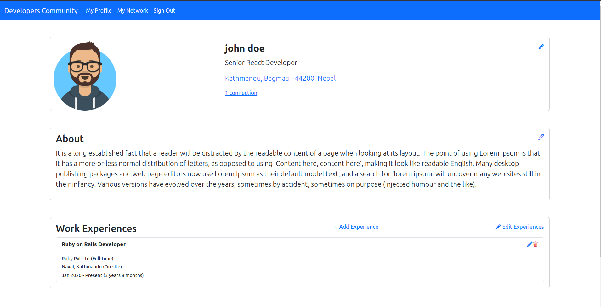
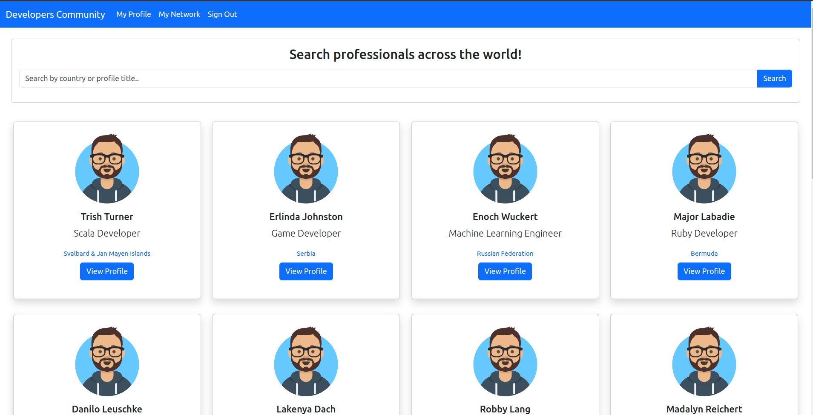
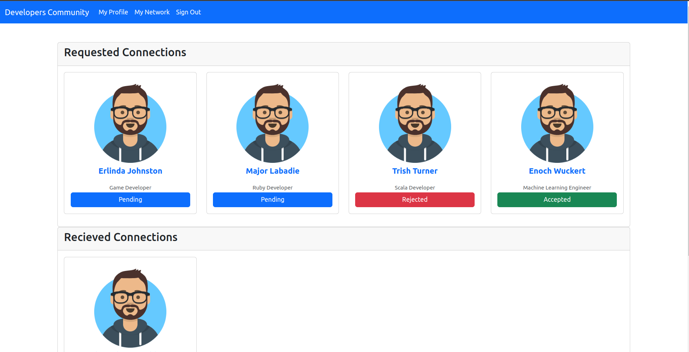

# Developers Community







## Requirements
- ruby "3.2.2"
- rails 7.0.8
- postgres
- node >= 14.x

## Installation
```
git clone https://github.com/sparshalc/DevelopersCommunity.git
cd developers-community
bundle install
```
## Database setup
```
## Development Env.
rails db:create
rails db:migrate
rails db:seed

## Test Env.
RAILS_ENV=test rails db:create
RAILS_ENV=test rails db:migrate
```

## Assets installation
```
yarn install
yarn build:css
```

## Run the project
```
rails server || bin/dev(requires foreman)
```
And then visit the http://localhost:3000

## Executing features specs:
```
bundle exec rspec spec/features/
```
* You need to install the chromedriver first to stimulate the feature specs.